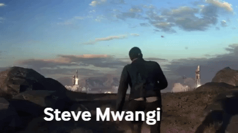

<h1 align='center'>
  Hi there 👋 I'm Steve 👨‍💻
</h1>

  Data && Software Engineer from Auburn, WA.

  &nbsp;&nbsp;

  &nbsp;&nbsp;

  &nbsp;&nbsp;

  

  

   

  <strong> Drink coffee and keep coding!</strong> 

# Table of Contents (Recent Projects)
1. [IoT Dapse 1](https://github.com/stevexenios/INSIGHT_DAPSE) 
          

